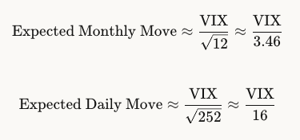

**1. What is VIX**   
Definition:    
The VIX Index (CBOE Volatility Index) measures the market's expectation of 30-day implied volatility for the S&P 500 Index. It is calculated from a weighted strip of out-of-the-money (OTM) SPX options.    

Key Characteristics   
(1) Unit  
Annualized implied volatility (percentage points)   
(2) Underlying  
S&P 500 Index (SPX) options  
(3) Horizon  
30-day forward-looking  

Interpreting VIX Levels:  
> VIX = 20 means the market expects SPX to move ±20% over one year (annualized)   

**Converting to Different Time Horizons:**  

